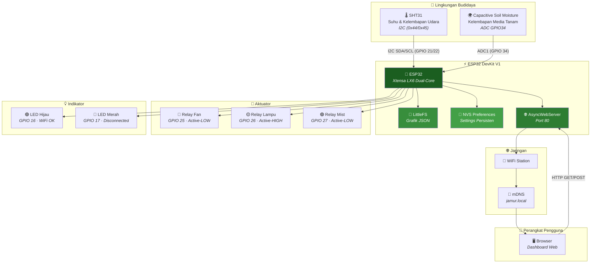
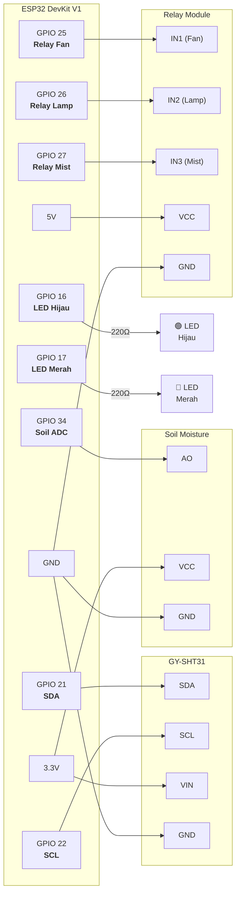
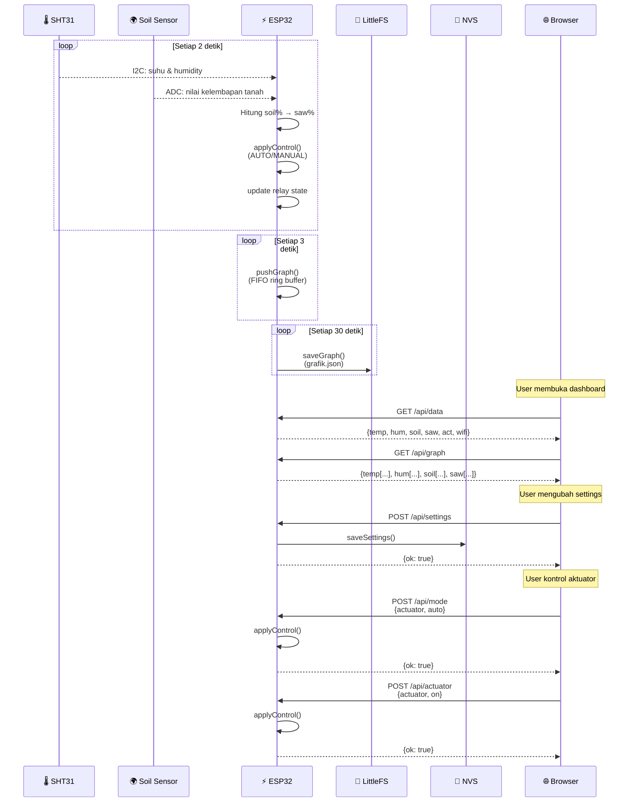
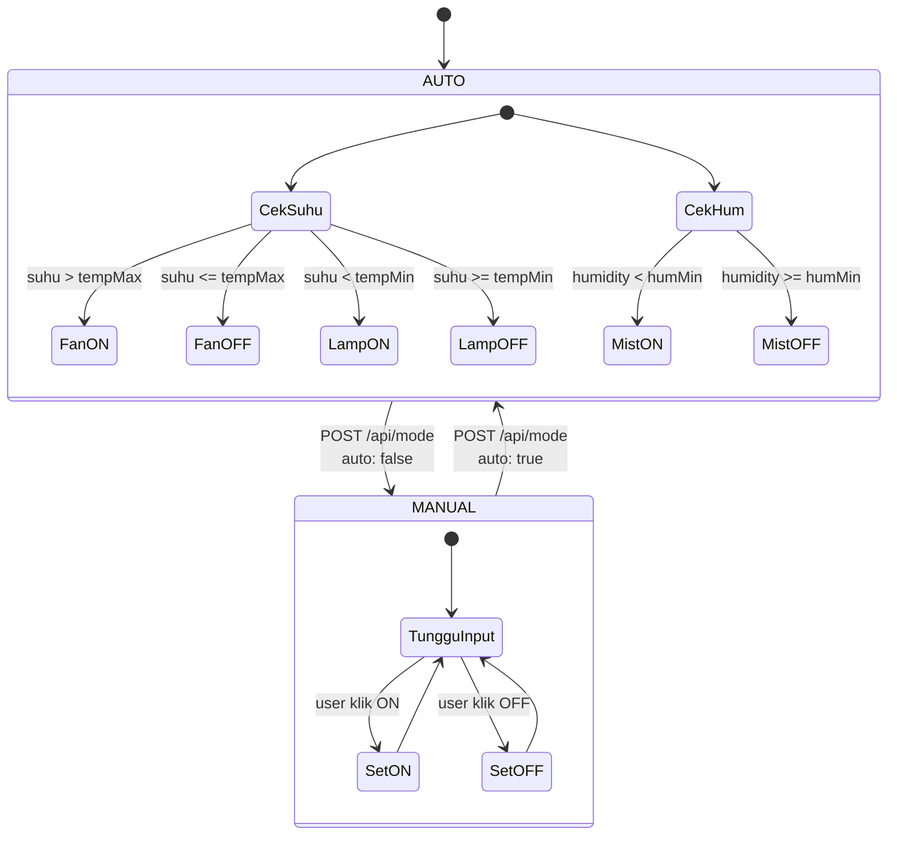
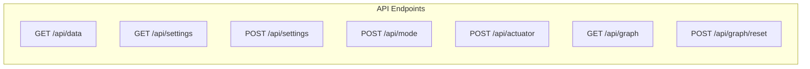

<div align="center">

# 🍄 MushroomIOT

**Rancang Bangun Sistem Budidaya Jamur Tiram**  
dengan Parameter Suhu, Kelembaban, dan Kelembapan Tanah Berbasis IoT

<br>

| | |
|---|---|
| **👤 Nama** | Muhammad Dzakwan Al Buchori |
| **🆔 NIM** | 062330701497 |
| **🎓 Prodi** | D3 Teknik Komputer |
| **🏛️ Institusi** | Politeknik Negeri Sriwijaya |
| **📅 Tahun** | 2026 |

<br>

[](https://www.arduino.cc/)
[](https://www.espressif.com/)
[](LICENSE)
[](https://github.com/Keyzoo0/MushroomIOT/commits/main)

</div>

---

## 📋 Daftar Isi

- [✨ Fitur](#-fitur)
- [🏗️ Arsitektur Sistem](#️-arsitektur-sistem)
- [🔌 Perangkat Keras](#-perangkat-keras)
- [📡 Alur Data](#-alur-data)
- [📁 Struktur Proyek](#-struktur-proyek)
- [💻 Perangkat Lunak](#-perangkat-lunak)
- [🚀 Cara Pakai](#-cara-pakai)
- [🌐 REST API](#-rest-api)
- [⚙️ Logika Kontrol](#️-logika-kontrol)
- [📸 Tampilan Web](#-tampilan-web)
- [📄 Lisensi](#-lisensi)

---

## ✨ Fitur

| Fitur | Detail |
|-------|--------|
| 🌡️ **Monitoring Realtime** | Suhu & kelembapan udara (SHT31), kelembapan media tanam, estimasi kadar air serbuk gergaji (baglog) |
| 📊 **Grafik FIFO 3 Menit** | 60 titik @3 detik, tersimpan di `grafik.json` (LittleFS) — tahan reboot |
| 🎛️ **Kontrol Per-Aktuator** | Mode **AUTO** (threshold-based) atau **MANUAL** (ON/OFF via web) |
| 🔧 **Pengaturan via Web** | Threshold suhu/kelembapan, kalibrasi ADC soil, batas status serbuk gergaji, reset grafik |
| 💾 **Persistent Storage** | Settings tersimpan di NVS (Preferences) — tahan reboot & re-flash |
| 📶 **WiFi + mDNS** | Akses via `http://jamur.local` — tanpa perlu ingat IP |
| 💡 **Indikator LED** | Hijau = WiFi connected, Merah = disconnected/reconnecting |

---

## 🏗️ Arsitektur Sistem



---

## 🔌 Perangkat Keras

### Komponen

| # | Komponen | Fungsi | Harga |
|---|----------|--------|-------|
| 1 | **ESP32 DevKit V1** | Mikrokontroler utama (WiFi + Bluetooth) | ~Rp 85.000 |
| 2 | **GY-SHT31** | Sensor suhu (±0.3°C) & kelembapan (±2%RH) via I2C | ~Rp 35.000 |
| 3 | **Capacitive Soil Moisture v1.2** | Sensor kelembapan media tanam (output analog 0-3.3V) | ~Rp 25.000 |
| 4 | **Relay 3-Channel 5V** | Saklar elektromekanik untuk Fan, Lampu, Mist Maker | ~Rp 40.000 |
| 5 | **LED 5mm (Hijau + Merah)** | Indikator status koneksi WiFi | ~Rp 3.000 |
| 6 | **Resistor 220Ω × 2** | Pembatas arus LED | ~Rp 1.000 |
| 7 | **Power Supply 5V/2A** | Catu daya sistem | ~Rp 30.000 |

### 🔌 Peta Pin ESP32



### 📊 Tabel Pin Lengkap

| Fungsi | GPIO | Jenis | Koneksi |
|--------|------|-------|---------|
| 🖥️ SHT31 SDA | **GPIO 21** | I2C Data | SHT31 SDA |
| 🖥️ SHT31 SCL | **GPIO 22** | I2C Clock | SHT31 SCL |
| 🌍 Soil Moisture | **GPIO 34** | ADC1 Input | Soil Moisture AO |
| 🔵 Relay Fan | **GPIO 25** | Digital Output | Relay IN1 |
| 🟡 Relay Lampu | **GPIO 26** | Digital Output | Relay IN2 |
| 🟢 Relay Mist | **GPIO 27** | Digital Output | Relay IN3 |
| 🟢 LED WiFi OK | **GPIO 16** | Digital Output | LED Hijau (+) via 220Ω |
| 🔴 LED Disconnect | **GPIO 17** | Digital Output | LED Merah (+) via 220Ω |

### ⚡ Logika Relay

| Relay | GPIO | Logika | ON | OFF |
|-------|------|--------|----|-----|
| 🔵 Fan (pendingin) | 25 | **Active-LOW** | `LOW` (0V) | `HIGH` (3.3V) |
| 🟡 Lampu (pemanas) | 26 | **Active-HIGH** | `HIGH` (3.3V) | `LOW` (0V) |
| 🟢 Mist Maker | 27 | **Active-LOW** | `LOW` (0V) | `HIGH` (3.3V) |

> **Catatan:** Modul relay yang umum menggunakan optocoupler dengan logika Active-LOW (IN=GND → relay ON). Sesuaikan jumper modul relay sesuai kebutuhan.

---

## 📡 Alur Data



### Diagram State Kontrol



---

## 📁 Struktur Proyek

```
📂 DzaqwanFiwmware/
├── 📄 DzaqwanFiwmware.ino    # Firmware utama ESP32 (417 baris)
├── 📄 README.md               # Dokumentasi ini
├── 📁 data/                   # ✈️ Upload ke LittleFS
│   ├── 📄 index.html          # Halaman web (Bootstrap 5 + Chart.js CDN)
│   ├── 📄 style.css           # Custom CSS (gradien, cards, animasi)
│   ├── 📄 app.js              # Logika frontend (polling, grafik, kontrol)
│   └── 📄 grafik.json         # Data grafik FIFO (auto-generated)
```

### 📄 Deskripsi File

| File | Bahasa | Baris | Fungsi |
|------|--------|-------|--------|
| `DzaqwanFiwmware.ino` | C++ (Arduino) | 417 | Firmware ESP32: sensor, kontrol, REST API, WiFi, mDNS, LittleFS |
| `index.html` | HTML5 | 260 | Dashboard UI: 3 tab (Dashboard, Settings, Info) |
| `style.css` | CSS3 | 196 | Styling: custom theme hijau, gradien, card, responsive |
| `app.js` | JavaScript (ES6) | 197 | Frontend: polling data, grafik Chart.js, kontrol aktuator |

---

## 💻 Perangkat Lunak

### 🛠️ Tools

| Tool | Versi | Fungsi |
|------|-------|--------|
| [Arduino IDE](https://www.arduino.cc/en/software) | 2.x | Compile & upload firmware |
| [ESP32 Arduino Core](https://github.com/espressif/arduino-esp32) | 3.x | Board support package |
| [LittleFS Upload Plugin](https://github.com/earlephilhower/arduino-littlefs-upload) | - | Upload file web ke SPIFFS/LittleFS |

### 📚 Library (Arduino Library Manager)

| Library | Versi | Fungsi |
|---------|-------|--------|
| [ESPAsyncWebServer](https://github.com/ESP32Async/ESPAsyncWebServer) | 3.x | Web server asinkronus + REST API |
| [AsyncTCP](https://github.com/ESP32Async/AsyncTCP) | 3.x | TCP library untuk ESPAsyncWebServer |
| [ArduinoJson](https://arduinojson.org/) | 7.x | Parsing & serialisasi JSON |
| [Adafruit SHT31](https://github.com/adafruit/Adafruit_SHT31) | 2.x | Driver sensor SHT31 via I2C |
| [Adafruit Unified Sensor](https://github.com/adafruit/Adafruit_Sensor) | 1.x | Abstraksi sensor (dependency) |
| [Adafruit BusIO](https://github.com/adafruit/Adafruit_BusIO) | 1.x | Komunikasi I2C/SPI (dependency) |

### 🌐 Frontend CDN

| Library | Versi | Fungsi |
|---------|-------|--------|
| [Bootstrap 5](https://getbootstrap.com/) | 5.3.3 | CSS framework (grid, komponen, tab) |
| [Bootstrap Icons](https://icons.getbootstrap.com/) | 1.11.3 | Icons |
| [Chart.js](https://www.chartjs.org/) | 4.4.3 | Grafik line realtime |
| [Google Fonts (Inter + Poppins)](https://fonts.google.com/) | - | Tipografi |

---

## 🚀 Cara Pakai

### ✅ Prasyarat

- Arduino IDE 2.x terinstal
- ESP32 board package terinstal
- Library di atas sudah diinstall

### 📦 Langkah Instalasi

```bash
# 1. Clone repositori ini
git clone https://github.com/Keyzoo0/MushroomIOT.git

# 2. Buka file DzaqwanFiwmware.ino di Arduino IDE
```

**3. Atur SSID & Password WiFi** — edit di baris 33-34:
```cpp
const char* WIFI_SSID = "ROSI1";
const char* WIFI_PASS = "20517420";
```

**4. Upload firmware:**
```
Tools → Board → ESP32 Dev Module
Tools → Port → (pilih port ESP32)
Sketch → Upload
```

**5. Upload file web ke LittleFS:**
```
Tools → ESP32 LittleFS Data Upload
```
> ⚠️ Plugin [arduino-littlefs-upload](https://github.com/earlephilhower/arduino-littlefs-upload) harus diinstal.

**6. Buka Serial Monitor** (115200 baud) — catat alamat IP ESP32.

**7. Akses dashboard:**
```
🌐 http://jamur.local   (via mDNS)
🌐 http://192.168.x.x    (via IP)
```

> ⚠️ Perangkat harus berada di jaringan yang **sama** dan **terkoneksi internet** (untuk CDN).

### ⚙️ Kalibrasi Sensor Soil

| Langkah | Cara |
|---------|------|
| 1 | Sensor di **udara terbuka** → catat nilai ADC → isi "ADC Kering" |
| 2 | Sensor **tercelup air penuh** → catat nilai ADC → isi "ADC Basah" |
| 3 | Sesuaikan batas "Kering" (default ≤50%) dan "Basah" (default ≥70%) |
| 4 | Klik **Simpan Pengaturan** |

---

## 🌐 REST API

### Endpoints



| Method | Endpoint | Request Body | Response | Fungsi |
|--------|----------|-------------|----------|--------|
| `GET` | `/api/data` | - | `{temp, hum, soil, saw, act, rssi, ip}` | Data sensor & status realtime |
| `GET` | `/api/settings` | - | `{tempMin, tempMax, humMin, ...}` | Ambil pengaturan |
| `POST` | `/api/settings` | `{tempMin: 22, ...}` | `{ok: true}` | Simpan pengaturan |
| `POST` | `/api/mode` | `{actuator: "fan", auto: true}` | `{ok: true}` | Set auto/manual |
| `POST` | `/api/actuator` | `{actuator: "fan", on: true}` | `{ok: true}` | Set ON/OFF (manual) |
| `GET` | `/api/graph` | - | `{temp: [...], hum: [...], ...}` | Data grafik FIFO |
| `POST` | `/api/graph/reset` | - | `{ok: true}` | Reset data grafik |

### Contoh Response `/api/data`

```json
{
  "temp": 28.5,
  "hum": 82.3,
  "soilADC": 1980,
  "soil": 65.2,
  "saw": 67.4,
  "sawCond": "Ideal",
  "sensorOK": true,
  "act": {
    "fan": { "on": false, "auto": true },
    "lamp": { "on": false, "auto": true },
    "mist": { "on": true, "auto": true }
  },
  "rssi": -65,
  "ip": "192.168.1.42",
  "wifi": true
}
```

---

## ⚙️ Logika Kontrol

### Threshold Default

| Parameter | Nilai | Aktuator | Aksi |
|-----------|-------|----------|------|
| 🌡️ Suhu Min | **22.0°C** | 🔥 Lampu (pemanas) | ON jika suhu < 22°C |
| 🌡️ Suhu Max | **30.0°C** | 💨 Fan (pendingin) | ON jika suhu > 30°C |
| 💧 Kelembapan Min | **80.0%** | 🌫️ Mist Maker | ON jika humidity < 80% |

### 🧮 Estimasi Kadar Air Serbuk Gergaji

```
sawPercent = clamp(soilPercent × 0.85 + 12.0, 0, 100)

Kondisi:
  ≤ sawDryMax (50%) → "Kering"
  ≥ sawWetMin (70%) → "Basah"
  else              → "Ideal"
```

> Formula ini berdasarkan karakteristik baglog jamur yang menahan air lebih baik dari tanah mineral.

---

## 📸 Tampilan Web

### 🖥️ Dashboard

| Panel | Konten |
|-------|--------|
| **Stat Cards** | Suhu, Kelembapan Udara, Kelembapan Tanah, Serbuk Gergaji + badge status |
| **Kontrol Aktuator** | 3 kartu (Fan, Lampu, Mist) dengan toggle AUTO/MANUAL + tombol ON/OFF |
| **Grafik** | 4 grafik line (Chart.js) — Suhu, Humidity, Soil, Sawdust — 3 menit terakhir |

### ⚙️ Settings

| Section | Pengaturan |
|---------|------------|
| **Threshold Mode Auto** | Suhu Min, Suhu Max, Kelembapan Min |
| **Kalibrasi Media** | ADC Kering, ADC Basah, Batas Kering, Batas Basah |
| **Tombol Aksi** | Simpan Pengaturan, Reset Data Grafik |

### ℹ️ Info

Informasi proyek, identitas penyusun, dan institusi.

---

## 📄 Lisensi

© 2026 — **Politeknik Negeri Sriwijaya**  
Laporan Tugas Akhir — disusun untuk memenuhi syarat menyelesaikan pendidikan  
pada Program Studi D3 Teknik Komputer, Jurusan Teknik Komputer,  
Politeknik Negeri Sriwijaya, Palembang.

---

<div align="center">
  <sub>Dibuat dengan ❤️ oleh Muhammad Dzakwan Al Buchori</sub>
</div>
